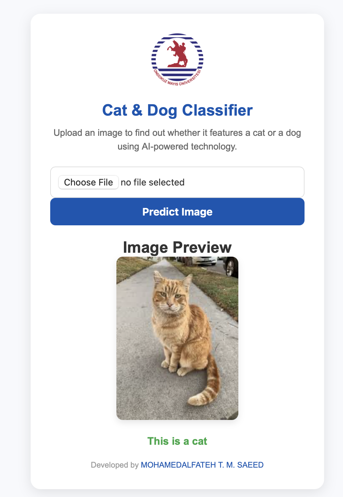
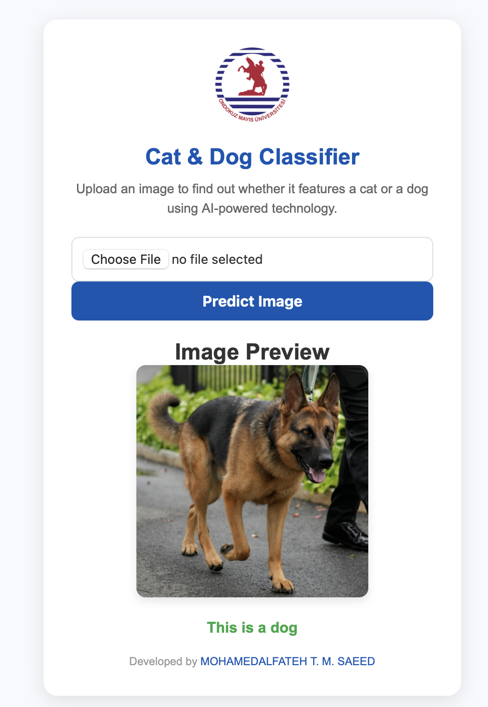

# Cat & Dog Classifier

## Overview

The **Cat & Dog Classifier** is a web-based image classification tool that leverages machine learning to predict whether an uploaded image contains a cat or a dog. This project utilizes Flask, HTML, CSS, and JavaScript to provide a simple, user-friendly interface for image classification.

Users can upload an image, and the model will predict whether the image contains a cat or a dog. The result is then displayed on the same page with an image preview, making it easy and intuitive for the user.

 

---

## Features

- **Image Upload**: Users can upload an image file from their local system.
- **Image Preview**: Displays a preview of the uploaded image before submitting.
- **Prediction Result**: Displays whether the uploaded image is of a cat or a dog after the model processes it.
- **Responsive Design**: The application has a modern and mobile-friendly design to ensure usability on different devices.
- **Powered by AI**: The model uses machine learning algorithms to predict the classification.

---

## Technologies Used

- **Python (Flask)**: Flask is used to serve the backend and handle image classification requests.
- **HTML5**: Used for structuring the frontend of the application.
- **CSS3**: Applied for styling the frontend and making the design modern and responsive.
- **JavaScript**: Used for image preview functionality and to handle file input dynamically.
- **TensorFlow / Keras**: The machine learning framework that powers the classification model.

---

## Installation

### Prerequisites

Before running the project, ensure you have the following installed:

- Python (3.6 or higher)
- Pip (Python's package installer)

### Steps to Run the Project

1. **Clone the repository**:

   ```bash
   git clone https://github.com/your-username/cat-dog-classifier.git
   cd cat-dog-classifier
    ```
2.	**Install required dependencies:**
It’s recommended to use a virtual environment for the project:
    ```bash
    python -m venv venv
    source venv/bin/activate   # On Windows use `venv\Scripts\activate`
    pip install -r requirements.txt
    ```
3.	Run the Flask Application:
    ```bash
    python app.py
    ```
After running this command, the application should be accessible at http://127.0.0.1:5000 in your web browser.

### Usage

1.	Open the web application in your browser.
2.	Click the “Choose File” button to upload an image.
3.	The image preview will appear immediately.
4.	Click the “Predict Image” button to submit the image for classification.
5.	The application will process the image and display the result below, indicating whether it’s a cat or a dog.
6.	If desired, users can upload another image for a new prediction.

